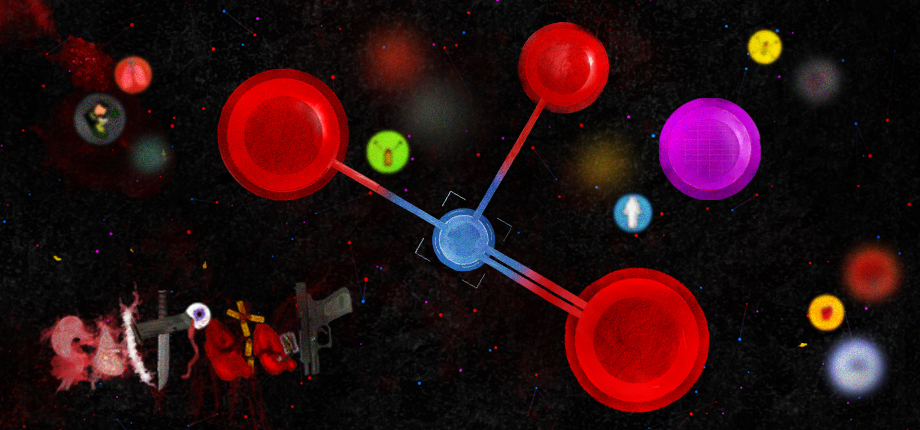
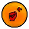

# SaltPeter
### An Online Competitive Top-down Roguelike.

[saltpeter.xyz](https://saltpeter.xyz/)

  

## Game
**RULES:** Players spawn in a top-down arena with limited ammo reserves, a ranged weapon and a melee weapon. A free-for-all fight commences, and the winner is the last player standing. All losing players choose a random upgrade, making it harder for the winner to maintain their streak.

## Lore
**CURRENT_YEAR:** 2380

**LOCATION:** Unknown *(Somewhere in Andromeda)*

Saltpeter takes place in the future after we have discovered a layer of processing for computers, smaller than microprocessors and nanoprocessors, called picoprocessors.

These electronics are so small that they can be installed between ions and atoms, on molecules and even ionic compounds. This allows us to manipulate the molecule with the processor installed physically on it.

**The entire game takes place in a potassium nitrate ionic compound.**

**Picoboards** are molecular level motherboards. They are powered by “picolinks” - which consist of two "picobatteries" and a P380 connector.

**Picolinks** are installed directly on structural bonds between atoms where connections are made to form molecules. They work similarly to a hydroelectric dam, charging themselves via the electronic potential differences between the bonded atoms like an energy gradient.

Quantum mechanical pico computation powered by bonded energy differentials.

   

## Tech
Saltpeter does not rely on any engine or codebase. It is written using typescript, javascript, html, and css.

The only external package used is WebSocket for networking.

## Inspiration
The tech design goals of this game are to create a top-down experience similar to [Hotline Miami](https://en.wikipedia.org/wiki/Hotline_Miami), with roguelike synergies akin to [The Binding of Isaac](https://en.wikipedia.org/wiki/The_Binding_of_Isaac_(video_game)). Finally, add a layer of persistence to visual effects like what we see in [Noita](https://en.wikipedia.org/wiki/Noita_(video_game)) or [Cortex Command](https://en.wikipedia.org/wiki/Cortex_Command) in an attempt to achieve **persistent particles and decals throughout rounds**.

This is achieved using client-side stamping mechanisms, and using static pixel data on a separate rendering canvas. Influenced directly by Daniel Tabar's implementation of static voxel data in the [Atomontage](https://www.atomontage.com/) engine. Blood, gore, and all effects in the game will stain the canvas, narrating a story of your battles.

## Modding
Want to create custom upgrades? See the [Upgrade Modding Guide](src/client/upgrades/readme.md)!

## Credits
Designed by Tukyo and Bigf0ck.

Built because we were tired of desyncing in isaac.

     

**This project is released under the [CC0 1.0 Universal license](LICENSE)**

*All assets, code, and related materials are public domain and may be used freely, including for AI training or commercial use. -Tukyo*